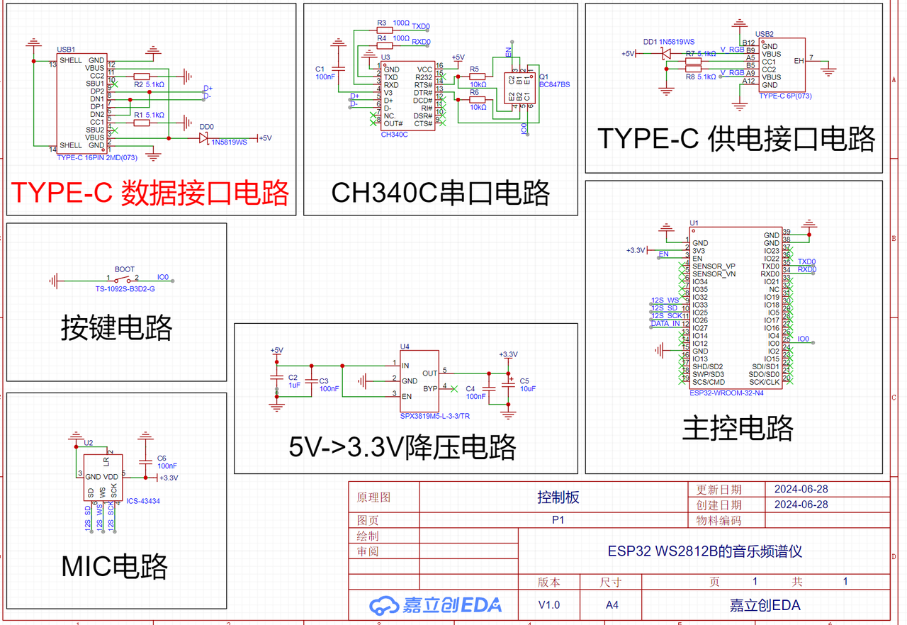
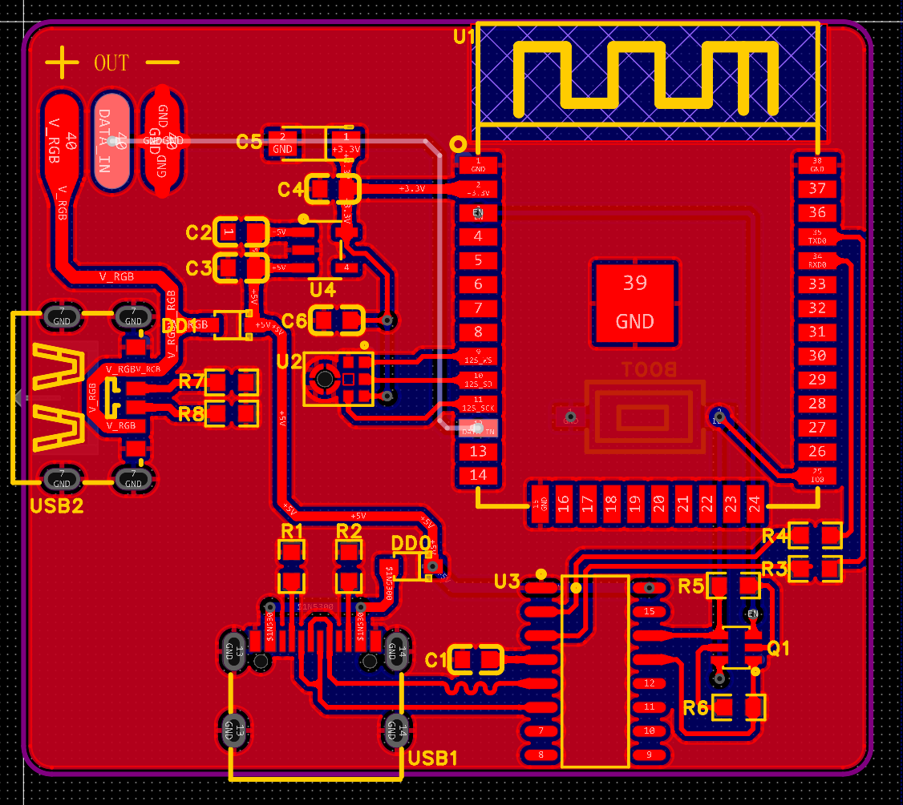
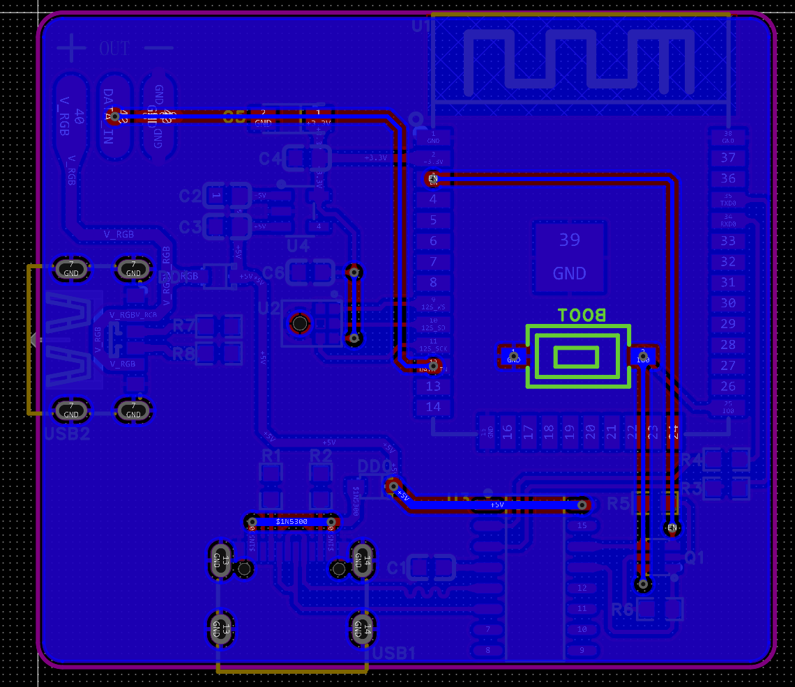
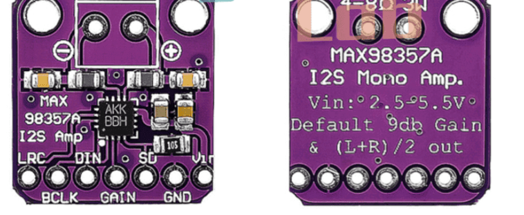
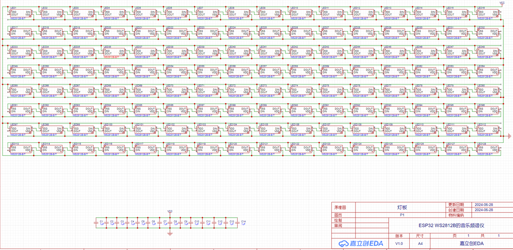
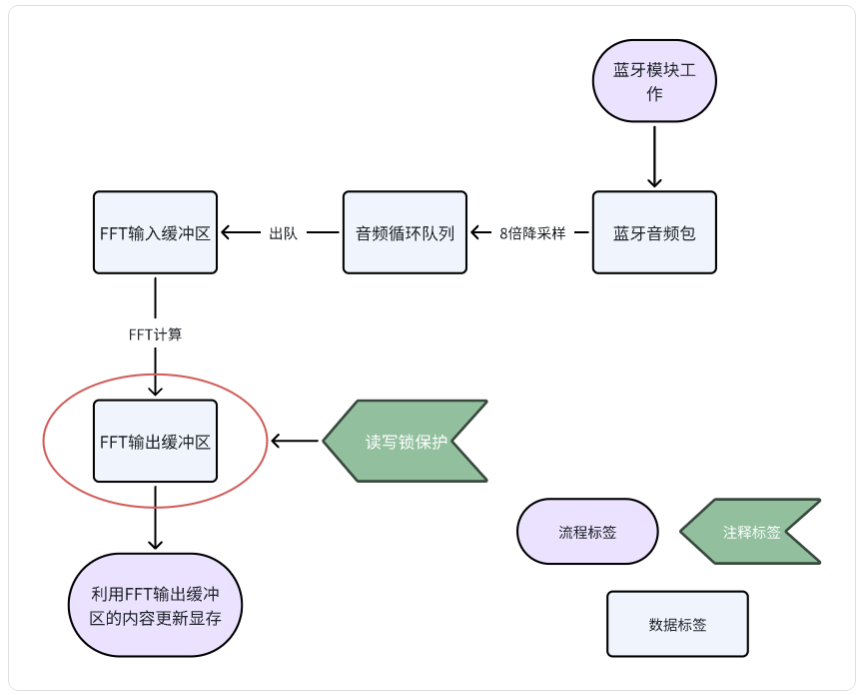
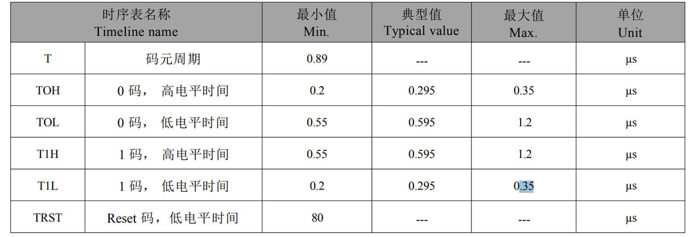
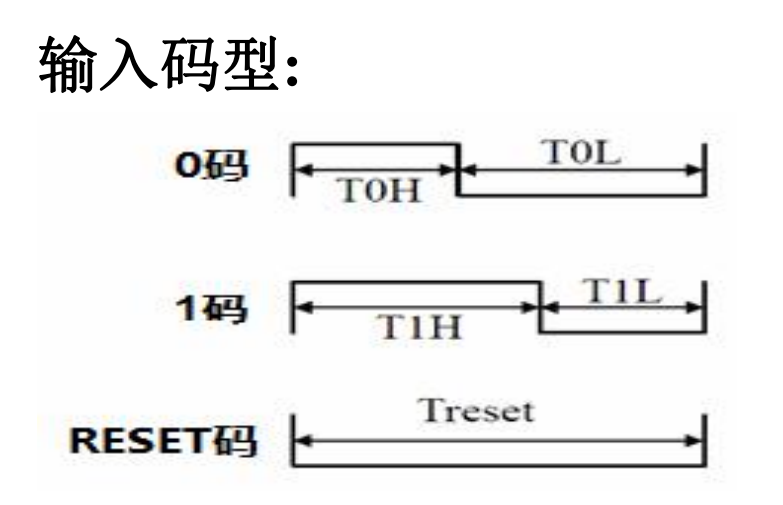
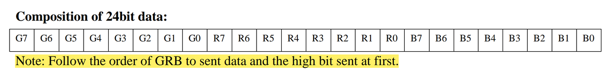

## 系统设计文档

### 硬件开发方案

##### 硬件开发分为两个部分，控制与灯板。

#### 控制板







后续考虑添加蓝牙音频播放功能，便以⻜线的形式添加到控制板上。

音频采用MAX98357模块，MAX98357是i2s输入，d类功放输出，无需滤波，直接链接扬声器，我们考
虑直接⻜线链接。（主要因为开题答辩之前就已经确认并投板了，开题答辩后才考虑添加蓝牙音频功
能，就想简单直接地添加模块就行）。MAX98357使用简单，价格便宜，参考较多，便选用这款。



#### 灯板



### 软件开发方案

#### 蓝牙音频参数

- **SBC** ：这是蓝牙标准组织开发的基本音频编解码器。它具有较低的 16 位深度速率、最大 320 Kbps 比特率和 48 kHz 最大频率。
  - 显示频率范围：48kHz / 8 = 6kHz

- **AAC** ：高级音频编码是 Apple 设备的蓝牙编解码器。采样率为44.1 kHz，最大比特率为^3 20 Kbps。

#### 软件架构总览

- 本次开发采用乐鑫科技推出的Espressif物联网开发框架（Espressif IoT Development
    Framework，ESP-IDF）作为基础框架进行开发。
- 使用经典蓝牙的A2DP协议进行音频流分发接收，使用AVRCP协议进行媒体信息通知与控制。乐鑫
    科技的ESP-IDF中提供了蓝牙A2DP协议的样例，在蓝牙协议栈的基础上提供了A2DP协议的功能，
    并将主控芯片虚拟为蓝牙音响设备。
  - 本次课设软件开发流程基于该A2DP样例，在此基础上添加FFT和ws2812b控制功能。

#### 关键数据流



#### 基于WS 2812 b的显示功能

- 波形要求





- 数据传输方法

  - 使用SPI向LED不断传输^0 比特或^1 比特以模拟高电平和低电平

  - 将SPI的时钟频率设为3.2Mhz，每个比特的时⻓为1 / 3.2Mhz = 0.3125us，此时四个比特为 0.3125us * 4 = 1.25us ，满足波形要求中TH+TL = 1.25us的要求。

    - 简单来说， SPI传输的^4 个比特被LED识别为一个比特

  - 0 code 设计

    - 如果我们希望LED接收到 0 ，我们需要精巧的设计四个比特来表示0的波形。

    - 答案是需要通过SPI传输四个比特：0b1000 （0x8） ，此时高电平持续的时间为0.3125us，满足220ns ~ 380ns 的范围。

  - 1 code 设计

    - 同理，使用SPI传输0b1110 （0xE） 表示LED接收的1

    - 0.3125 * 2 = 0.625 us，满足580ns ~ 1us 范围

- 代码优化

  - 由于我们每次都需要向一个LED传输24bits来表示RGB三种颜色，取出每一个每个bit再对应到1000 或 1110 非常复杂。因此我们使用一个uint16_t的数组来表示每次向LED传输的 4 个比
特。
    ```cpp
    static uint16_t LedBitPattern[ 16 ] = {
    0x8888, // -> 0000
    0x8E88, // -> 0001
    0xE888, // -> 0010
    0xEE88, // -> 0011
    0x888E, // -> 0100
    0x8E8E, // -> 0101
    0xE88E, // -> 0110
    0xEE8E, // -> 0111
    0x88E8, // -> 1000
    0x8EE8, // -> 1001
    0xE8E8, // -> 1010
    0xEEE8, // -> 1011
    0x88EE, // -> 1100
    0x8EEE, // -> 1101
    0xE8EE, // -> 1110
    0xEEEE // -> 1111
    };
    ```

  - 上述代码有几点需要注意的地方

    - 用0x8表示0 ，用0xE表示1

    - 由于数据以字节为单位进行小端存储，因此对于uint16_t的类型， 0xABCD 四个字母的传输顺序为CDAB，所以想要表示 0001 需要使用0x8E88

- 色彩传输方法

  - 注意到传输顺序为GRB而非RGB

    

    ```
    memset(ledDMAbuffer, 0 , LED_DMA_BUFFER_SIZE);
    int n = 0 ;
    for (i = 0 ; i < LED_MAX_NBER_LEDS; i++) {
        uint32_t temp = display_buffer[i];

        //G
        ledDMAbuffer[n++] = LedBitPattern[0x0f & (temp >> 12 )];
        ledDMAbuffer[n++] = LedBitPattern[0x0f & (temp)>> 8 ];

        //R
        ledDMAbuffer[n++] = LedBitPattern[0x0f & (temp >> 4 )];
        ledDMAbuffer[n++] = LedBitPattern[0x0f & (temp)];

        //B
        ledDMAbuffer[n++] = LedBitPattern[0x0f & (temp >> 20 )];
        ledDMAbuffer[n++] = LedBitPattern[0x0f & (temp)>> 16 ];
    }
    ```

#### 频谱展示方案

- 插入代码截获蓝牙收到的音频包，降采样后存放在循环队列中

    ```
    void bt_app_a2d_data_cb(const uint8_t *data, uint32_t len)
    {
        write_ringbuf(data, len);
        if (data) enqueue((char*)data, len); // 这里为插入的代码
    }

    // 下面是enqueue的定义，包含音频数据降采样
    int enqueue(const char *data, size_t len) {
        if (_size + len / SAMPLE_STEP > queue_max_len) {
            ESP_LOGW(FFT_TAG, "queue full, clear with size %d, data len %d",
            size(), len / SAMPLE_STEP);
            clear();
        }

        for (size_t i = 0 ; i < len; i += SAMPLE_STEP* 2 ) {
            data_queue[_tailp] = data[i];
            _tailp = (_tailp + 1 ) % queue_max_len;
            data_queue[_tailp] = data[i+ 1 ];
            _tailp = (_tailp + 1 ) % queue_max_len;
            _size += 2 ;
        }
        return 0 ;
    }
    ```

- 使用ESP-IDF提供的FFT加速计算代码进行FFT的计算，并注意加入读写锁，防止FFT的结果同时被
    刷新和写入显存

    ```
    dsps_fft2r_fc32(fft_input, FFT_POINTS);
    dsps_bit_rev_fc32(fft_input, FFT_POINTS);
    dsps_cplx2reC_fc32(fft_input, FFT_POINTS);

    xSemaphoreTake(fft_data_semaphore, portMAX_DELAY);
    fft_maxval = 0 ;
    for (int i = 0 ; i < FFT_POINTS/ 2 ; i++) {
        if(i == 0 ){
            fft_out[i] = sqrt(fft_input[ 2 *i] * fft_input[ 2 *i] +
            fft_input[ 2 *i+ 1 ] * fft_input[ 2 *i+ 1 ]);
        }
        else{
            fft_out[i] = 2 *sqrt(fft_input[ 2 *i] * fft_input[ 2 *i] +
            fft_input[ 2 *i+ 1 ] * fft_input[ 2 *i+ 1 ]);
        }
        
        if (fft_out[i] > fft_maxval) fft_maxval = fft_out[i];
        phase_out[i] = atan2(fft_input[ 2 *i+ 1 ], fft_input[ 2 *i]) * 180.0 / PI + 180.0;
    }
    xSemaphoreGive(fft_data_semaphore);

    // nyw:放一个神奇的EMA在这里，作用只可意会不可言传
    static float fft_prev_maxval;
    fft_maxval = fft_maxval * 0.9 + fft_prev_maxval * 0.1;
    fft_prev_maxval = fft_maxval;
    ```

- 将相位和振幅数据分别作为HSV颜色空间中的Hue（色度）值与Saturation（饱和度）值，并转换
    到RGB色彩空间作为显示。将 16 个点的频谱打印到显示缓冲区中，等待刷新。

  - 此处也要加入读写锁，防止FFT被更新的同时刷入显存

    ```cpp
    extern float fft_out[FFT_POINTS>> 1 ]; // 0 ~ fft_maxval
    extern float fft_maxval;
    extern float phase_out[FFT_POINTS>> 1 ]; // 0 ~ 360
    SemaphoreHandle_t fft_data_semaphore = NULL;
    void write_fft2screen_display_buffer() {
        xSemaphoreTake(fft_data_semaphore, portMAX_DELAY);
        for (int i = 0 ; i < RESOL_H; i++) {
            for (int j = 0 ; j < RESOL_W; j++) {
                if ( fft_maxval == 0 || i >= fft_out[j] / fft_maxval * RESOL_H) {
                    display_buffer[screen_indices_map[i][j]] =
                    0x00;
                }
                else {
                    display_buffer[screen_indices_map[i][j]] = hsv_to_rgb(phase_out[j], 0.8, 0.2);
                }
            }
        }
        xSemaphoreGive(fft_data_semaphore);
    }
    ```

- 使用简单的delay方法定时刷新显示缓冲区。

  - 为方便开发和调试，没使用定时器中断的方案（）

    ```
    void display_main(void *arg) {
        while ( 1 ) {
            write_fft2screen_display_buffer();
            led_strip_update();
            vTaskDelay(pdMS_TO_TICKS(FLASH_RATE_MS));
        }
    }
    ```

- 将显示模块安装到freertos中

    ```cpp
    static TaskHandle_t timer_xHandle = NULL;
    void display_start() {
        fft_data_semaphore = xSemaphoreCreateBinary();
        xSemaphoreGive(fft_data_semaphore);
        init_screen_indices_map();
        initSPIws2812();

        memset(display_buffer, 0 , sizeof(display_buffer));
        led_strip_update(); // clear screen

        xTaskCreate(display_main, "timer_task", 2048 , NULL, 5 , &timer_xHandle);
    }
    ```

### 整体效果

#### 测试视频


#### 演示视频

